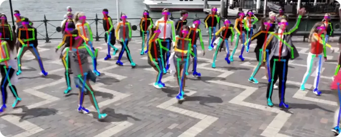
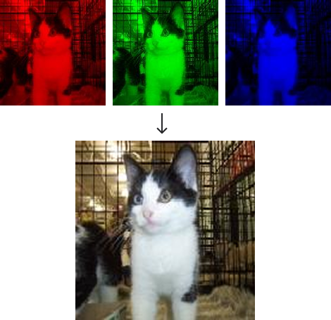
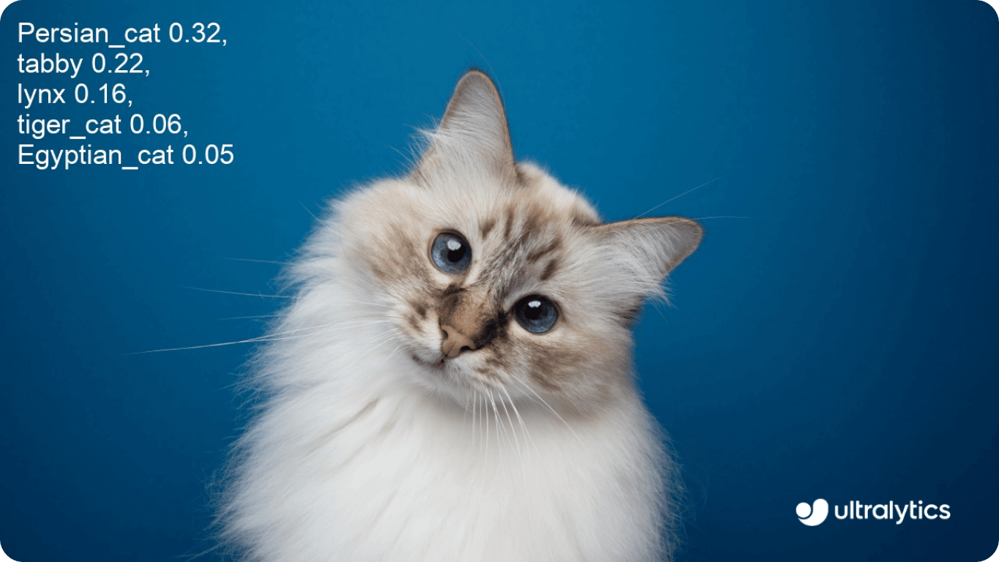
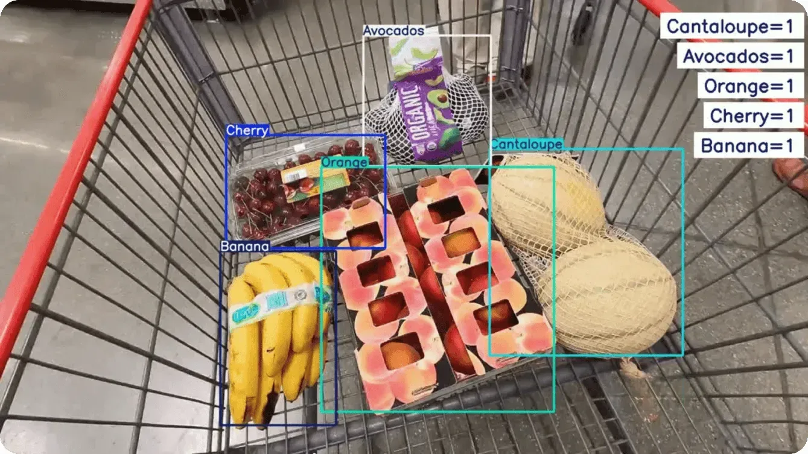
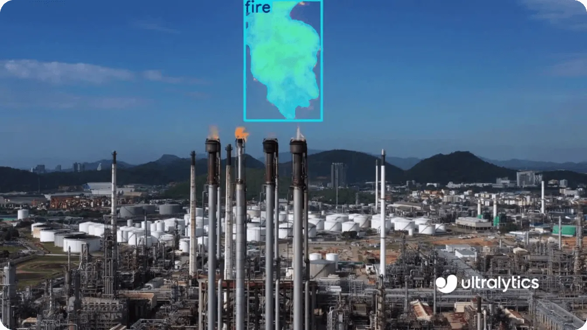

::title::
コンピュータビジョンとその応用

::date::
<SlideDate />

---
layout: toc
---

::title::
目次

---
layout: section
---

# コンピュータビジョン (CV) とは

---
layout: two-cols
---

::title::
コンピュータビジョン (CV) とは

::left::
コンピュータビジョンとは？

<div class="ml-2">
<carbon-arrow-right class="mr-2" />画像やビデオなどの視覚的な入力を処理・分析する人工知能の一分野
</div>

どんなことに使われているのか？

- 顔認証/顔認識
- 自動運転システム
- 向上での品質欠陥の検知

図1のように人の姿勢を推定することもできる

::right::
<figure class="h-full flex flex-col items-center justify-center">
  
  <figcaption class="text-sm text-gray-600 mt-2">図1 人物姿勢推定 (引用:ultralytics)</figcaption>
</figure>

---
layout: two-cols
---

::title::
画像とは

::left::

コンピュータにとって画像とは？

<div class="ml-2">
<carbon-arrow-right class="mr-2" />数値（ピクセル）の配列
</div>


**グレースケール画像**
- 各ピクセル: 0〜255の1つの値

**カラー画像 (RGB)**
- 各ピクセル: R, G, B の3層
- 各層が0〜255の値を持つ

::right::


<figure class="h-full flex flex-col items-center justify-center">
  
  <figcaption class="text-sm text-gray-600 mt-2">図2 赤・緑・青の層が重なって画像になる様子</figcaption>
</figure>

---
layout: two-cols
---

::title::
機械学習とは

::left::
機械学習とは？

<div class="ml-2">
<carbon-arrow-right class="mr-2" />データからパターンを学習し、予測や判断を行うAIの手法
</div>

**従来のプログラミング**
- ルールを人間が明示的に記述

**機械学習**
- データから自動的にルールを学習

::right::
<div class="h-full flex flex-col items-center justify-center text-sm">

```
従来のプログラミング:
  入力 + ルール → 出力

機械学習:
  入力 + 出力 → ルール(モデル)
```

<div class="mt-4 p-4 bg-blue-50 rounded">
例: 犬と猫の分類

1. 大量の犬・猫画像を用意
2. 各画像に「犬」「猫」のラベル付け
3. モデルが特徴を自動学習
4. 新しい画像を判定可能に
</div>
</div>

---
layout: section
---

# CVの3大タスク

---

::title::
CVの3大タスク

::default::

コンピュータビジョンには代表的な3つのタスクがある

| タスク | 入力 | 出力 |
|--------|------|------|
| **分類** | 画像全体 | カテゴリラベル |
| **検出** | 画像全体 | 物体の位置 + ラベル |
| **分割** | 画像全体 | ピクセルごとのラベル |

---
layout: two-cols
---

::title::
分類 (Classification)

::left::
**画像分類とは？**

<div class="ml-2">
<carbon-arrow-right class="mr-2" />画像全体を1つのカテゴリに分類する
</div>

**特徴**
- この画像は何か？に答える
- 定義したカテゴリに必ず分類される

**応用例**
- 医療画像の診断補助

::right::
<figure class="h-full flex flex-col items-center justify-center">
  
  <figcaption class="text-sm text-gray-600 mt-2">図3 画像分類の例 (引用:ultralytics)</figcaption>
</figure>

---
layout: two-cols
---

::title::
検出 (Detection)

::left::
**物体検出とは？**

<div class="ml-2">
<carbon-arrow-right class="mr-2" />画像内の物体の位置と種類を特定する
</div>

**特徴**
- どこに何があるか？に答える
- 定義したカテゴリから選ばれる

**応用例**
- カメラでの人物検出

::right::

<figure class="h-full flex flex-col items-center justify-center">
  
  <figcaption class="text-sm text-gray-600 mt-2">図4 画像検出の例 (引用:ultralytics)</figcaption>
</figure>
---
layout: two-cols
---

::title::
分割 (Segmentation)

::left::
**セグメンテーションとは？**

<div class="ml-2">
<carbon-arrow-right class="mr-2" />画像の各ピクセルにラベルを付与する
</div>

**特徴**
- どのピクセルが何か？に答える

**応用例**
- 自動運転での道路/歩道の認識
- 背景除去・画像編集

::right::

<figure class="h-full flex flex-col items-center justify-center">
  
  <figcaption class="text-sm text-gray-600 mt-2">図5 画像分割の例 (引用:ultralytics)</figcaption>
</figure>
---
layout: section
---

# タスクの体験

---

::title::
タスクの体験 (Google Colab)

::default::

以下のリンクをクリックしてColabを開いてください

<div class=" my-8">
  <a href="https://colab.research.google.com/github/micanis/trial_class/blob/main/code/dot_ipynbs/experience.ipynb" target="_blank" class="text-2xl underline text-blue-600">
    Colabで開く
  </a>
</div>

1. 上のリンクをクリック
2. 「ドライブにコピー」で自分のアカウントに保存（任意）
3. 上から順にセルを実行していく

---

::title::
参考文献

::default::

| 図 | 出典 |
|----|------|
| 図1 | Ultralytics Blog - [What is OpenPose](https://www.ultralytics.com/ja/blog/what-is-openpose-exploring-a-milestone-in-pose-estimation) |
| 図2 | 自作 |
| 図3 | Ultralytics Blog - [Image Classification](https://www.ultralytics.com/ja/blog/how-to-use-ultralytics-yolo11-for-image-classification) |
| 図4 | Ultralytics Blog - [Object Detection Models](https://www.ultralytics.com/ja/blog/the-best-object-detection-models-of-2025) |
| 図5 | Ultralytics Blog - [Instance Segmentation](https://www.ultralytics.com/ja/blog/how-to-use-ultralytics-yolo11-for-instance-segmentation) |

---
